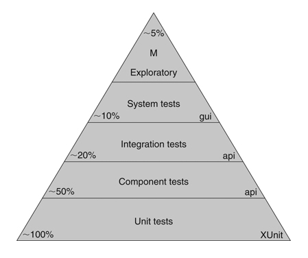

# Tutorial about testing React application


## Test types



**Manual** - при разработке мы так или иначе тестируем код, проверяя результат 'на глаз'.

**Unit:**

 -  Тестирование функционала в изоляции

 -  Не тестируют контракты между модулями

 - Приходится писать много boilerplate кода


**Integration**  - Тестируют связанный функционал, к примеру флоу авторизации:

- Медленные

- Требуют много ресурсов

- Тяжело писать

- НЕ могут симулировать ошибки

- Не показывают где именно произошла ошибка


***


**Technologies:**

1. [JEST](https://jestjs.io/docs/ru/tutorial-react) - Test Runner - отвечает за исполнение (вызов) тестов и предоставляет библиотеку для
валидации. Тесты не в браузере а в Node.

2. [SINON](https://sinonjs.org/)

3. [Enzyme](https://airbnb.io/enzyme/) - эмулирует Реакт-приложение, позволяет маунтить компоненты и работать с DOM.

***

## Что тестировать

  Ненадо тестировать сами библиотеки, они уже покрыты тестами

  Ненадо тестировать HTTP-запросы, вместо этого эмулируйте данные ответа и тестируйте их
влияние

  Не тестируйте сложные отношения. К примеру кликаем кнопку в одном месте, и в другом
должно что-то происходить. Это зависимость компонента от компонента. Вместо этого
можно тестировать эффект клика кнопки отдельно, а реакцию на изменение состояния
отдельно

  Тестируйте в изоляции: редюсер, метод компонента, условный рендер


***

## JEST


### Настройка с Create React App

Если вы только знакомитесь с React, мы рекомендуем использовать Create React App. Готово к использованию и поставляется вместе с Jest! Вам понадобится только добавить **_react-test-renderer_** для рендеринга снимков.

```

yarn add --dev react-test-renderer

```

**Filename Conventions**

Jest will look for test files with any of the following popular naming conventions:

- Files with .js suffix in __tests__ folders.

- Files with .test.js suffix.

- Files with .spec.js suffix.


The .test.js / .spec.js files (or the __tests__ folders) can be located at any depth under the src top level folder.

We recommend to put the test files (or __tests__ folders) next to the code they are testing so that relative imports appear shorter. 
For example, if App.test.js and App.js are in the same folder, the test just needs to import App from './App' instead of a long relative path. 
Collocation also helps find tests more quickly in larger projects.


### [Настройка без Create React App](https://jestjs.io/docs/ru/tutorial-react#%D0%BD%D0%B0%D1%81%D1%82%D1%80%D0%BE%D0%B9%D0%BA%D0%B0-%D0%B1%D0%B5%D0%B7-create-react-app)


**Out of the box, Create React App only supports overriding these Jest options:**

  • collectCoverageFrom

  • coverageReporters

  • coverageThreshold

  • extraGlobals

  • globalSetup

  • globalTeardown

  • resetMocks

  • resetModules

  • snapshotSerializers

  • watchPathIgnorePatterns

****

## Enzime

``` 

npm i --save-dev enzyme enzyme-adapter-react-16

```

to see the result of  output as strting:

```

const wrapper = shallow(<Book title="Huckleberry Finn" />);
console.log(wrapper.debug());

```

***

## Useful links:

- [create-react-app/docs/running-tests](https://facebook.github.io/create-react-app/docs/running-tests)

- [GoIt React course testing](https://app.schoology.com/course/1438662537/materials/gp/1640123789)

- [simpletut github repo](https://github.com/simpletut/Testing-React-Redux-with-Jest-and-Enzyme)

- [simpletut youtube](https://www.youtube.com/watch?v=EgJZv9Iyj-E&list=PL-Db3tEF6pB8Am-IhCRgyGSxTalkDpUV_)

- [Unit testing ReactJS Redux Actions, Reducers and Epics with Jest](https://itnext.io/unit-testing-redux-actions-reducers-and-epics-with-jest-484f8a59f1f2)

